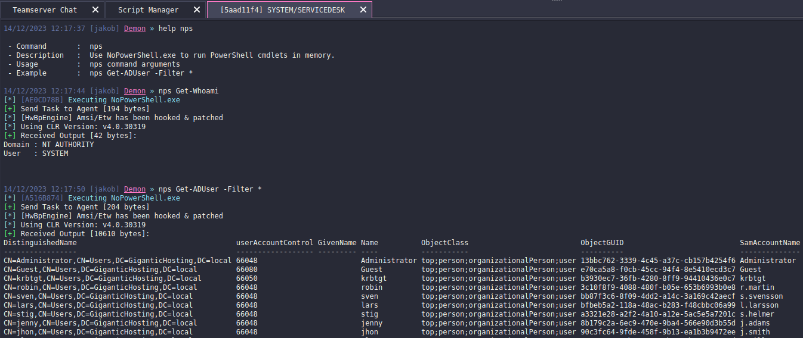

# NoPowerShell for Havoc C2
Havoc plugin allowing in-memory execution of PowerShell cmdlets. Original functionality based on [NoPowerShell by bitsadmin](https://github.com/bitsadmin/nopowershell).

## Installation 
### Manual Installation
1. Clone the repository
   ```
   git clone https://github.com/jakobfriedl/havoc-NoPowerShell
   ```
3. Load Script using Script Manager
   
   
## Usage
```
nps <command> <arguments>
```
A detailed list of available commands can be found [here](https://github.com/bitsadmin/nopowershell/blob/master/CHEATSHEET.md).

## Screenshots



